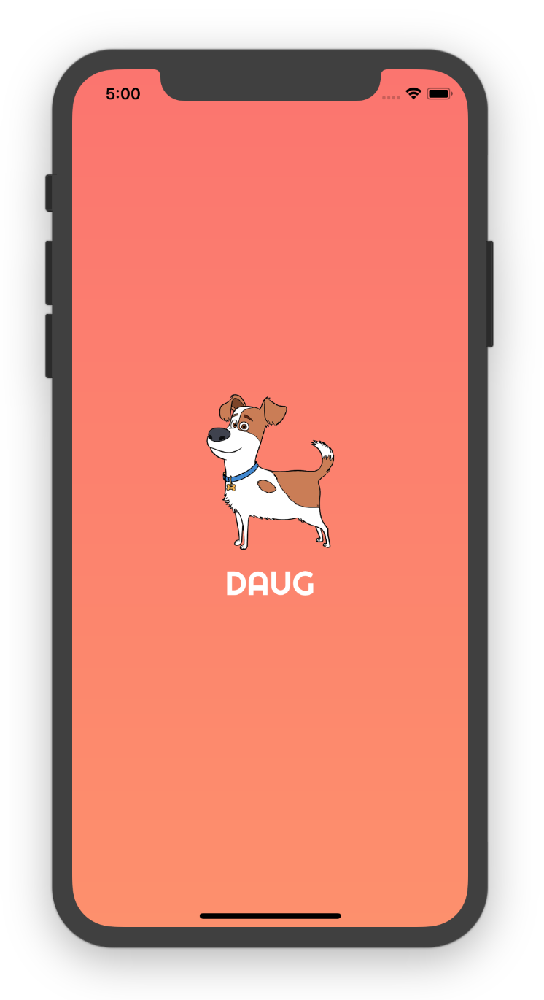
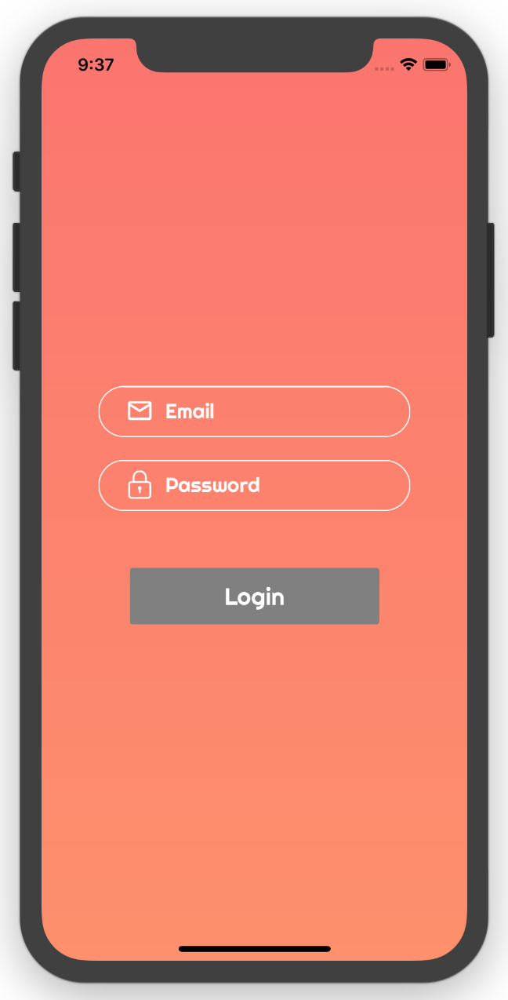
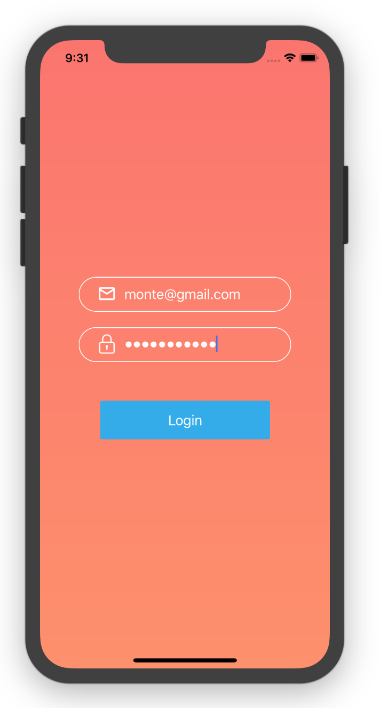

# Daug mobile app

This repo is the mobile app for Daug.

## What's Daug?

**Daug is a social network for pets.**

- Your pets can **sign up or login** using their paws.
- They can **upload selfies** or **post their thoughts** for other pets to see.
- They can also look at **other pets posts** and either **paw** (like) or **scratch** (dislike) it.

### [Demo - Try it on Expo](https://exp.host/@monte9/daug-mobile)

## Getting started

```
git clone git@github.com:mobilespace/daug-mobile.git

exp start

exp ios
```

## Assignment #1

### Objectives

- Learn how to build & organize screens in RN
- Learn advanced RN styling and use LinearGradient, Image, Icons & Custom Fonts
- Learn how to use mock data for prototyping UI screens
- Learn how to use NPM libaries such as React Native Elements, Expo & React Native Vector Icons

## Designs

App layout primarily based on Instagram's UI KIT as seen (here)[https://www.sketchappsources.com/free-source/2023-instagram-based-ui-kit-sketch-freebie-resource.html]. You can download the Sketch file and look at all the screens.

Intro, Login & Sign up screen based on Robinhood App.

### Other design ideas

- [Login screen designs on Pinterest](https://www.pinterest.com/timoa/mobile-ui-logins/?lp=true)
- [Mobile UI on Dribble](https://dribbble.com/search?q=mobile+UI)

### TODO

- [ ] Design & build an Intro Screen
  - [ ] :star: **Bonus:** Add [Snap Carousel]() with [Lottie animations]() to Intro Screen
- [ ] Design & build an Signup Screen
  - [ ] :star: **Bonus:** Add buttons to sign up with Facebook & Twitter
- [ ] Design & build an Login Screen
  - [ ] :star: **Bonus:** Add buttons to login with Facebook & Twitter
- [ ] Design & build an Profile Screen
  - [ ] :star: **Bonus:** Add the Logout button
- [ ] Design & build an Social Feed Screen with [Mock Data]()
  - [ ] :star: **Bonus:** Add the Logout button
- [ ] Attach screenshots to readme - each should be it’s own component

### Demo
<div stlye={{display: flex; flex-direction: row}}>
  
  
  
  
</div>

## Submission

Once you have completed the assignment, please create a new issue on this repo with the title as your name and add the link to your repo in the description. One of the TA's will review your code and add your name to the list of completed submissions below if all looks good.

### Completed submissions

- [ ] Ryan Liszewski
- [ ] Thomas Zhu
- [ ] Bhavesh Chowdhury
- [ ] Sukhjit Singh
- [ ] Prakash Gurung
- [ ] Nicholas Szeto
- [ ] Emanuel Saunders
- [ ] William Hua
- [ ] Mitul Savani
- [ ] Jakhongir Khusanov
- [ ] Teodora Caneva
- [ ] Affaan Ghazzali
- [ ] Girish Rawat
- [ ] Karan Gupta

## Problems?

In case you run into any problems or issues, please post it on #questions channel on the MobileSpace Slack.

## Finally

For any other questions about this repo or MobileSpace in general please reach out to [**@monte9**](https://github.com/monte9) on Github.


